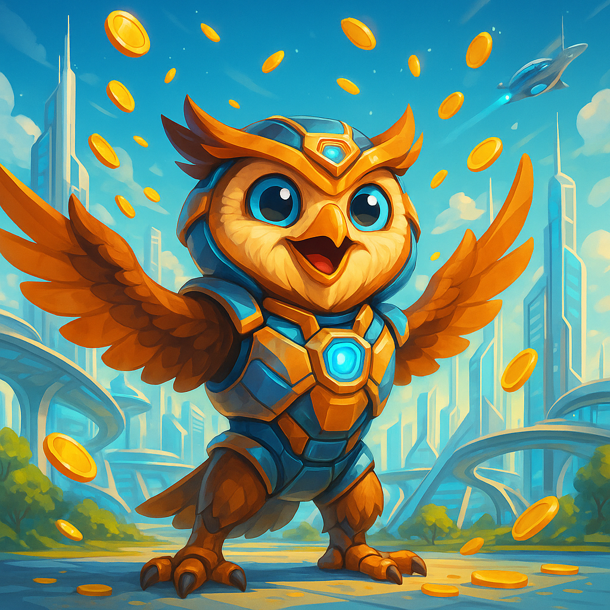

<div align="center">
  
  <h1>OwlToken 🦉</h1>
  <h4>Secure and Advanced Token Contract for Modern Blockchain</h4>
</div>

---

## About The Project

**OwlToken** is a production-ready smart token contract running on the Soroban blockchain, offering advanced security and management features.  
The project stands out with its admin-based mint/burn capabilities, account freezing functionality, flexible management, and decentralized infrastructure, in addition to classic token transfers and allowances.

- **Modular architecture** (each function in its own file)
- **Freeze capability:** Admin can freeze/unfreeze accounts to prevent malicious activities
- **Admin Control:** Secure management of supply increase, burning, and admin changes
- **Secure transfers and allowances** (Similar to ERC20 - transfer_from, approve, etc.)
- **Test-verified and extensible structure**

---

## Deployment Information

### Contract Details
- **Network:** Stellar Testnet
- **Contract ID:** `CAQOTADHGME4H35QAOHZDNADNTESEJP5GZIJ2LC25SRWWGQUWNVNNDQG`
- **Admin Address:** `GBZ2VCQQUKFUP2WMFRQZODNM2AK65CMHPR2R2KG3PPEUYMUSIKOZAQ2P`

### Token Information
- **Name:** OwlToken
- **Symbol:** OWL
- **Decimals:** 8
- **Initial Supply:** 1,000,000,000

---

## Installation and Building

1. **Clone the repository:**
    ```sh
    git clone https://github.com/gokcearda/OwlToken.git
    cd owltoken
    ```

2. **Install dependencies and build:**
    ```sh
    cargo build --release --target wasm32-unknown-unknown
    ```
    This will generate:  
    `target/wasm32-unknown-unknown/release/owltoken.wasm`

3. **Tests (optional):**
    ```sh
    cargo test
    ```

---

## Usage

1. **Get a testnet address** using Freighter or another wallet
2. **Deploy the contract** using Soroban CLI:
    ```sh
    soroban contract deploy --wasm target/wasm32-unknown-unknown/release/owltoken.optimized.wasm --source-account YOUR_SECRET_KEY --rpc-url "https://soroban-testnet.stellar.org" --network-passphrase "Test SDF Network ; September 2015"
    ```
3. **Initialize the contract** and set up admin
4. **Start using the functions:**
    - **Mint:** Create new tokens and assign to users
    - **Transfer:** Transfer between users
    - **Burn:** Burn tokens
    - **Freeze/Unfreeze:** Freeze/unfreeze user accounts
    - **Approve/Transfer_from:** Spending authorizations (allowances)

---

## Project Structure

```plaintext
owltoken/
├── src/
│   ├── lib.rs             # Main contract integration
│   ├── contract.rs        # Transfer and total supply
│   ├── admin.rs           # Admin controls, mint/burn
│   ├── balance.rs         # Balance operations
│   ├── allowance.rs       # Allowance system
│   ├── freeze.rs          # Account freezing
│   ├── metadata.rs        # Token info functions
│   ├── storage_types.rs   # Storage keys
│   └── test.rs            # Basic unit/integration tests
├── Cargo.toml
├── README.md
└── assets/
    └── image.png          # OwlToken logo
```

---
## Contributing & License

We welcome all feedback and contributions.  
Code is under MIT license.

---

<div align="center">
  
  <br/>
  <b>🦉 Building a smart, powerful, transparent, and secure economy on blockchain with OwlToken!</b>
</div>